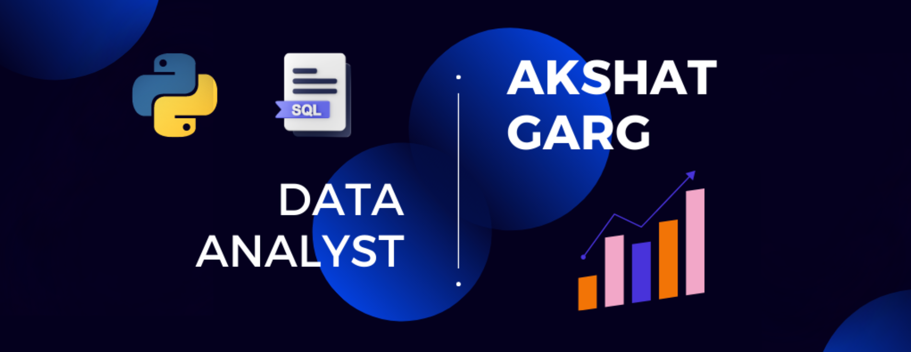

<h1 align="center">Hi 👋, I'm Akshat Garg</h1>
<h3 align="center">I Visualize what data cannot 🤔</h3>

  

  

- 🔭 I’m currently working on **Portfolio Website**

- 🌱 I’m currently learning **Machine Learning Models**

- 💬 Ask me about **Data Analytics**

- 📫 How to reach me **akasatgarg@gmail.com**

- ⚡ Fun fact **I am innovative**

<h3 align="left">Connect with me:</h3>

&nbsp;

